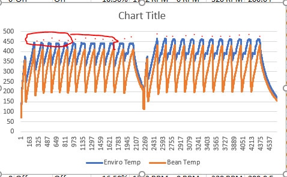
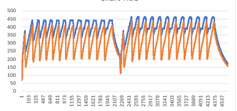
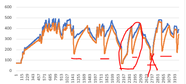

RoasterSyncer

This project was custom designed for a roasting setup that uses 
"PLC controller for Red Lion.
This unit logs all data and current settings of the roaster every 5 seconds and puts out 1 file for each day we operate the machine.
So it spits out a lot of data off which we only need a few things."

The output is designed to be used in Artisan Roaster Scope. It's free and pretty popular with coffee roasters.

The purpouse of these scripts is to import a "daily" CSV and then output "Roasts CSV files"

After getting the script to work, we put together a TKlinter UI so the warehouse workers could run the script, and get a picture with feedback on wither it worked... and if it didn't, where the problem was.

